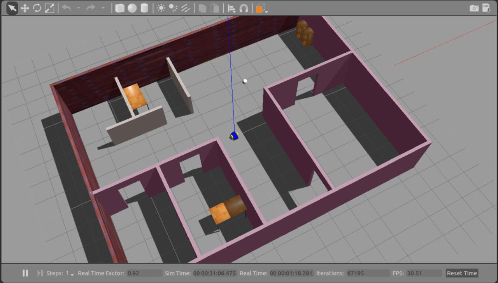
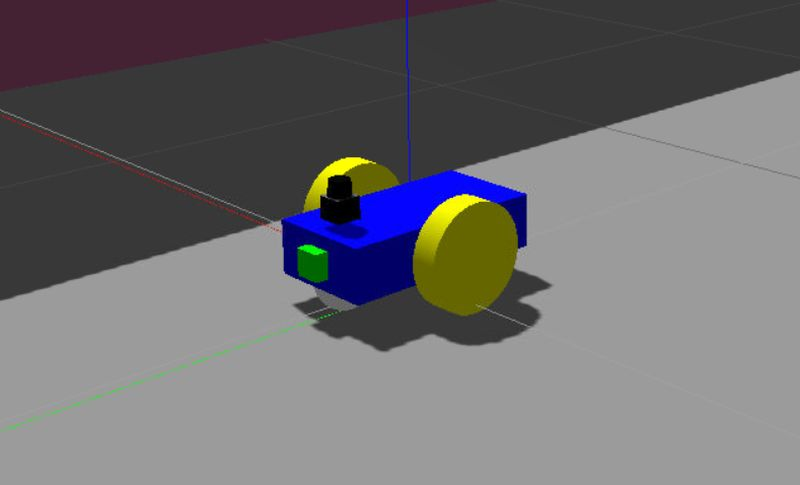
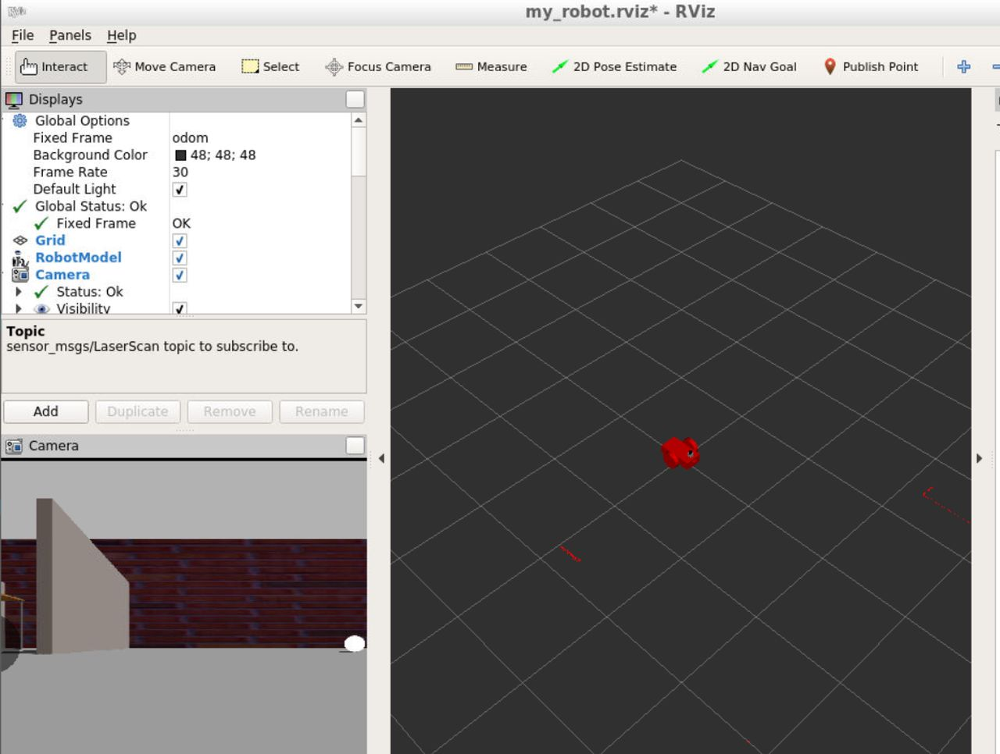

# Robotics_ROS_Ball_Chaser

ROS imlementation of a simple Robot within a Gazebo simulated office.  The robot uses
a camera to look for a white ball and navigates towards it.

Contains two ROS packages:
1. **my_robot**:  Simple robot consisting of 2 rotation wheels and a caster wheel for movement, a Camera and LiDAR sensor for sensing.

2. **ball_chaser**:  Ball chaser package with 2 nodes implemented in C++:
- **drive_bot**:  Service for commanding robot's movement
- **process_image**:  Subcribes to raw images, detects if a white ball is withing Field of View and drives the bot accordingly.

## Usage

Clone the code into your catkin workspace

Build:
`$ cd ~/catkin_ws`
`$ catkin_make`

Launch the robot, Gazebo World, and RViz:

`roslaunch my_robot world.launch`

Launch ball chaser:

`roslaunch ball_chaser ball_chaser.launch`

## Evnironment

Developed and tested on ROS Kinetic

## Images

### Office Environment in Gazebo

### Robot with 2 wheels and caster, Camera and LiDAR sensors

### RViz with Camera and LiDAR views

